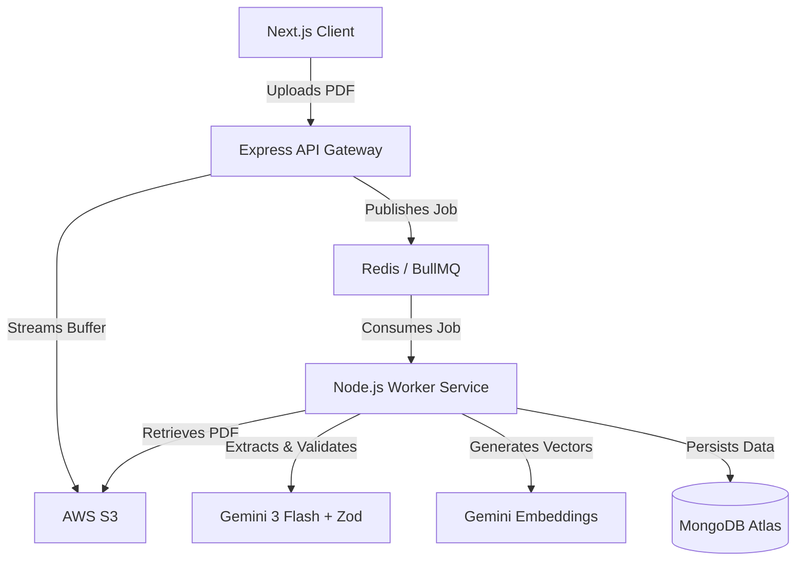

# AI Applicant Tracking System (Event-Driven Architecture)

[](https://nextjs.org/)
[](https://turbo.build/)
[](https://redis.io/)
[](https://www.mongodb.com/)

An event-driven Applicant Tracking System (ATS) built to process unstructured PDF data into structured, queryable vector intelligence. The architecture is explicitly decoupled to handle heavy ML/LLM workloads without blocking the main API thread.

---

## 🏗️ System Architecture

The monorepo separates the ingestion layer (API) from the processing layer (Worker) via a Redis message queue, ensuring high availability during batch resume uploads.



---

## ⚙️ Engineering Deep Dive

### 1. Asynchronous Ingestion Pipeline
*   **Problem:** Parsing massive PDFs and waiting for LLM extraction responses severely blocks the Node.js event loop, causing API timeouts under concurrent loads.
*   **Solution:** Built a decoupled, event-driven ingestion pipeline using **BullMQ** and **Redis**. The API Gateway instantly acknowledges uploads and delegates processing to dedicated background worker nodes.
*   **Outcome:** Processed 50+ concurrent resumes per batch, reducing main-thread API blocking by **95%**.

### 2. Dual-Layer AI Schema Validation
*   **Problem:** Relying on LLMs for structured data often results in "schema poisoning" (hallucinated keys, nested JSON failures) crashing the MongoDB ingestion script.
*   **Solution:** Engineered a strict validation boundary. The system forces Gemini to output against a defined JSON schema, which is then piped through a rigid **Zod** parsing layer before database insertion.
*   **Outcome:** Achieved **99.9% data integrity** in unstructured-to-structured data transformations.

### 3. Context-Aware Semantic Matching
*   **Problem:** Traditional ATS systems use basic Regex/keyword matching, failing to recognize synonymous skills or semantic depth.
*   **Solution:** Replaced keyword filters with **768-dimensional vector embeddings**. The worker generates vectors for both candidate experiences and job descriptions, storing them in MongoDB Atlas for cosine similarity searches.
*   **Outcome:** Enabled automated semantic gap analyses, allowing recruiters to rank candidates based on conceptual fit rather than exact string matches.

---

## 🛠️ Technology Stack

*   **Infrastructure:** Turborepo, Docker, AWS S3, GitHub Actions (CI/CD).
*   **Frontend:** Next.js 15 (App Router), Tailwind CSS 4.
*   **API & Workers:** Node.js, Express, BullMQ, Redis.
*   **Data & AI:** MongoDB Atlas (Vector Search), Mongoose, Google Gemini AI, Zod.
*   **Observability:** Pino (Structured JSON Logging), Helmet (Security).

---

## 💻 Local Setup & Orchestration

### 1. Environment Configuration
Clone the repository and populate your `.env` file based on `.env.example`:
```bash
git clone https://github.com/sasidhar-jonnalagadda/ai-applicant-tracking-system.git
cd ai-applicant-tracking-system
cp .env.example .env
```
*Requires AWS S3 credentials, MongoDB Atlas URI, and a Gemini API key.*

### 2. Infrastructure Initialization
Start the local Redis broker and sync the workspace:
```bash
docker compose up -d redis
npm install
```

### 3. Vector Database Indexing
To enable semantic candidate matching, initialize the 768-dimension cosine similarity index on your MongoDB Atlas cluster:
```bash
npm run db:index
```

### 4. Boot the Microservices
Launch the Web app, API, and Worker threads simultaneously via Turborepo:
```bash
npm run dev
```

---

## 📄 License
MIT License. See [LICENSE](./LICENSE) for details.