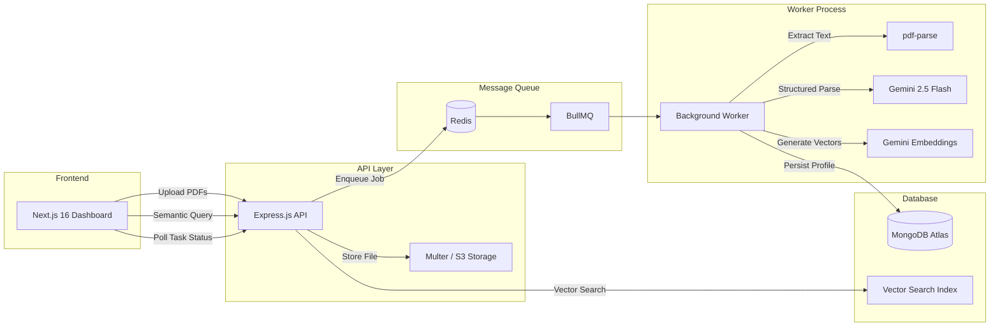

<div align="center">

# ⚡ AI Applicant Tracking System

### Production-Grade AI Ingestion Engine for Modern Recruiting

An event-driven, monorepo-architected Applicant Tracking System that transforms raw PDF resumes into structured, searchable candidate intelligence using **Gemini 2.5 Flash** and **MongoDB Atlas Vector Search**.

[](https://github.com/sasidhar-jonnalagadda/ai-applicant-tracking-system/actions/workflows/ci.yml)


</div>

---

## Why This Exists

Most ATS platforms treat resumes as flat text. **The AI Applicant Tracking System** treats them as structured data — extracting typed candidate profiles via generative AI, then embedding them as semantic vectors for conceptual search. Recruiters search by *meaning*, not keywords.

---

## Architecture


**How it works:**

1. Recruiter uploads resumes (up to 50 at once) through the **Next.js** dashboard
2. The **Express API** stores files and enqueues parsing jobs into **Redis via BullMQ**
3. The **Background Worker** picks up jobs, extracts text with `pdf-parse`, and sends it to **Gemini 2.5 Flash** with a strict JSON schema for structured extraction
4. The worker generates **semantic vector embeddings** via `gemini-embedding-2` and persists the full candidate profile + embedding to **MongoDB**
5. Recruiters perform **conceptual search** — "experienced React developer with DevOps background" — powered by **MongoDB Atlas Vector Search**

---

## Key Features

### 🔄 Bulk Async Ingestion
Upload up to **50 resumes simultaneously**. Each file is processed independently via BullMQ with exponential backoff retry (5 attempts), automatic job pruning, and real-time status polling from the dashboard. The API never blocks; uploads return immediately with task IDs.

### 🧠 Gemini 2.5 Flash Structured Extraction
Raw PDF text is transformed into **typed candidate profiles** using Gemini's structured output mode with a strict JSON schema. Every field — skills, experience, education, contact info — is validated at the boundary using **Zod schemas** before database admission.

### 🔍 Semantic Vector Search
Candidate profiles are embedded as **768-dimensional vectors** using `gemini-embedding-2` and indexed via **MongoDB Atlas Vector Search**. Search by concept ("backend engineer with cloud experience") rather than exact keyword match.

### 🎯 Explainable AI Match Breakdown
Each candidate receives a **job-specific AI analysis**: strengths, weaknesses, missing keywords, and **3 tailored interview questions**. Recruiters can expand any candidate card to see exactly *why* the AI scored them the way it did.

---

## Tech Stack

| Layer | Technology |
|-------|-----------|
| **Frontend** | Next.js 16, React 19, TypeScript, Tailwind CSS 4, Lucide React |
| **Backend API** | Express.js 4, Helmet, CORS, Morgan, express-rate-limit, Zod 4 |
| **Worker** | BullMQ 5, pdf-parse, Google Generative AI SDK |
| **Database** | MongoDB 8 (Mongoose), Redis (ioredis) |
| **AI** | Gemini 2.5 Flash (extraction), gemini-embedding-2 (vectors) |
| **Storage** | AWS S3 (production), Local disk (development fallback) |
| **DevOps** | Turborepo 2.8, Docker Compose, GitHub Actions CI |
| **Governance** | ESLint (flat config), Prettier, centralized TypeScript strict mode |

---

## Project Structure
```text
ai-applicant-tracking-system/
├── .github/workflows/     # CI pipeline
├── apps/
│   └── web/               # Next.js 16 recruiter dashboard
│       ├── app/
│       │   ├── page.tsx    # Dashboard (upload, search, analysis UI)
│       │   ├── layout.tsx  # Root layout with fonts
│       │   ├── env.ts      # Frontend env validation (Zod)
│       │   └── globals.css # Tailwind design tokens
│       └── next.config.js  # Standalone output, security headers
│
├── packages/
│   ├── backend-api/        # Express.js API server
│   │   └── src/
│   │       ├── config/     # Env, Redis, S3 configs
│   │       ├── routes/     # Upload, candidates, jobs endpoints
│   │       ├── services/   # AI embeddings, queue producer
│   │       ├── utils/      # asyncHandler middleware
│   │       └── index.ts    # Server entry + rate limiting + error handler
│   │
│   ├── worker/             # BullMQ background processor
│   │   └── src/
│   │       ├── config/     # Env, Redis, S3 configs
│   │       ├── processors/ # Resume extraction + Gemini prompting
│   │       └── index.ts    # Worker lifecycle + graceful shutdown
│   │
│   ├── shared/             # Cross-package type library
│   │   └── src/
│   │       ├── models/     # Mongoose schemas (Candidate, Job, Task)
│   │       ├── types/      # Zod schemas + TS interfaces
│   │       ├── db.ts       # Singleton MongoDB connection
│   │       └── index.ts    # Frontend-safe exports (no Mongoose)
│   │
│   ├── eslint-config/      # Centralized lint rules
│   └── typescript-config/  # Centralized TS governance
│
├── docker-compose.yml      # Local MongoDB + Redis
├── turbo.json              # Build pipeline with dist/** caching
└── package.json            # Workspace root
```

---

## Getting Started

### Prerequisites

| Requirement | Version |
|------------|---------|
| **Node.js** | 20+ |
| **Docker** | Any recent version |
| **Google Gemini API Key** | [Get one here](https://aistudio.google.com/apikey) |

### 1. Clone the Repository
```bash
git clone [https://github.com/sasidhar-jonnalagadda/ai-applicant-tracking-system.git](https://github.com/sasidhar-jonnalagadda/ai-applicant-tracking-system.git)
cd ai-applicant-tracking-system
```

### 2. Install Dependencies

```bash
npm install
```

### 3. Configure Environment
```bash
cp .env.example .env
```

Open `.env` and add your **Gemini API Key**. All other values have working defaults for local development:
```env
GEMINI_API_KEY=your_actual_key_here   # ← Required
```

> **Note:** The `AWS_ACCESS_KEY_ID=dummy_access_key` default triggers the local disk storage fallback — no S3 bucket needed for development.

### 4. Start Infrastructure
```bash
docker compose up -d
```

This starts **MongoDB** on port `27017` and **Redis** on port `6379`.

### 5. Run the Development Server
```bash
npm run dev
```

This starts all three services concurrently via Turborepo:

| Service | URL | Description |
|---------|-----|-------------|
| **Frontend** | `http://localhost:3000` | Next.js recruiter dashboard |
| **Backend API** | `http://localhost:3001` | Express REST API |
| **Worker** | — | Background BullMQ processor (no HTTP) |

---

## Environment Variables

| Variable | Required | Default | Description |
|----------|----------|---------|-------------|
| `GEMINI_API_KEY` | ✅ | — | Google Gemini API key for AI extraction and embeddings |
| `MONGODB_URI` | ✅ | — | MongoDB connection string |
| `PORT` | — | `3001` | Backend API port |
| `NODE_ENV` | — | `development` | Environment mode |
| `REDIS_HOST` | — | `127.0.0.1` | Redis hostname |
| `REDIS_PORT` | — | `6379` | Redis port |
| `AWS_REGION` | — | `us-east-1` | S3 bucket region |
| `AWS_ACCESS_KEY_ID` | ✅ | — | Set to `dummy_access_key` for local disk fallback |
| `AWS_SECRET_ACCESS_KEY` | ✅ | — | Set to `dummy_secret_key` for local disk fallback |
| `AWS_S3_BUCKET` | ✅ | — | S3 bucket name (any value works for local) |
| `NEXT_PUBLIC_API_URL` | — | `http://localhost:3001` | API URL for the frontend |
| `FRONTEND_URL` | — | — | Frontend origin for CORS whitelist (required in production) |

---

## Available Scripts

Run from the **workspace root**:

| Command | Description |
|---------|-------------|
| `npm run dev` | Start all services in development mode (hot-reload) |
| `npm run build` | Production build of all packages via Turborepo |
| `npm run lint` | Lint all packages with ESLint |
| `npm run check-types` | Typecheck all packages (runs `tsc --noEmit`) |
| `npm run format` | Format all files with Prettier |

---

## Production Hardening

This project includes enterprise-grade production safeguards:

- **Differentiated Rate Limiting** — Strict limiter for mutations (100 req/15min), relaxed limiter for polling (300 req/min)
- **Centralized Error Handler** — Catches Zod validation, Mongoose, and CastError with standardized JSON responses
- **Graceful Shutdown** — Both API and worker handle SIGTERM/SIGINT with connection cleanup and forced exit timeouts
- **Process Crash Guards** — `unhandledRejection` and `uncaughtException` handlers prevent silent crashes
- **Structured Logging** — All console output uses `[TAG:LEVEL]` format for log aggregator compatibility
- **Turbo Caching** — Incremental builds with content-hash caching (74ms cached rebuilds)

---

## License

[MIT](LICENSE)